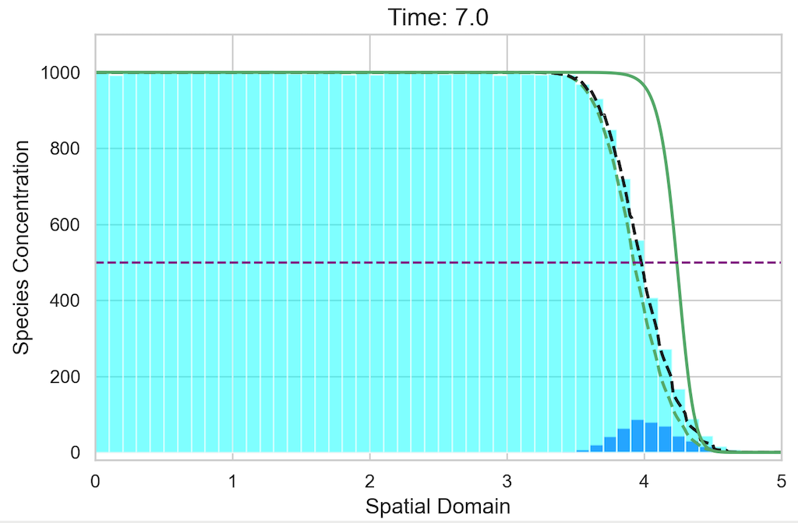

# Charlie Cameron

I’m a PhD student in the SAMBa CDT at the University of Bath, where I develop hybrid stochastic–deterministic models to better understand complex biological systems. My research focuses on reaction–diffusion processes, such as the Fisher-KPP model, where stochastic effects play a crucial role in system dynamics. However, fully stochastic simulations can be computationally expensive, so I combine them with more efficient PDE-based methods in regions where randomness has less impact.

## Research

I'm currently working on the **Spatial Regime Conversion Method (SRCM)** combining:
- **Stochastic Simulation Algorithms (SSA)** in low-density regions  
- **Partial Differential Equations (PDEs)** in high-density regions

This hybrid approach improves efficiency while preserving key stochastic behaviours. A paper outlining a novel spatial regime conversion method for these models is to be submitted soon.

I'm currently extending this idea into **1D reaction–diffusion systems**, building on [Kynaston, Yates et al. (2015)](https://doi.org/10.3389/fams.2023.1107441) the *regime conversion method*. 
You can find the working code of the **SRCM** for the Fisher-KPP method [on GitHub](https://github.com/Cgyc20/SRCM_KPP).

Figure: Stochastic solution (cyan), hybrid method (black dashed) combining stochastic (dark blue) and PDE (green dashed) regions, and pure PDE solution (solid green).
---

## Supervision

I'm supervised by:
- **Professor Dr Kit Yates**  — Department of Mathematical Sciences, University of Bath  
- **Dr Cameron Smith** Department of Mathematical Sciences, University of Bath

---

## Contact

If you have any questions or want to connect then here are my details:

- 📧 Email: [cgyc20@bath.ac.uk](mailto:cgyc20@bath.ac.uk)  
- 🐙 [GitHub](https://github.com/cgyc20)